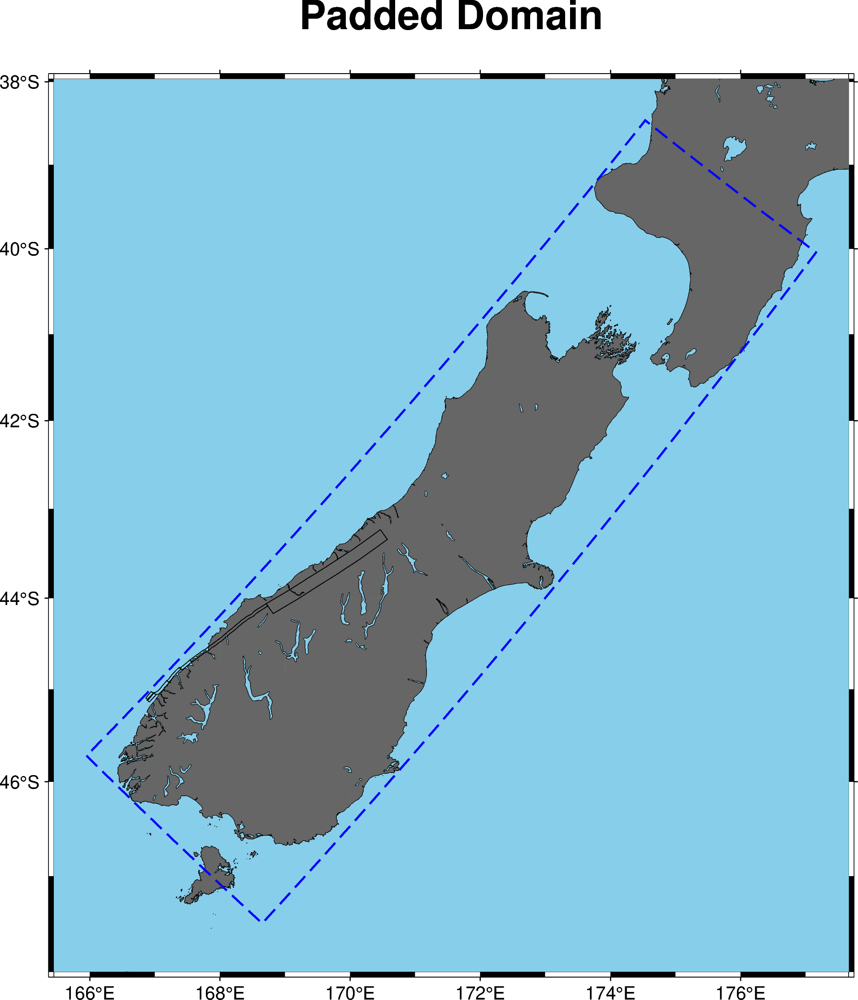
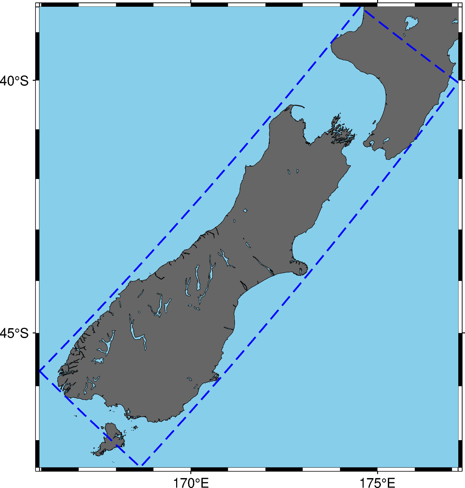
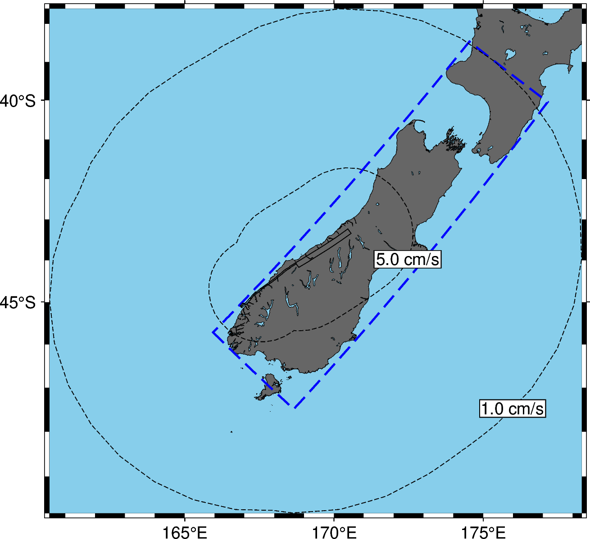
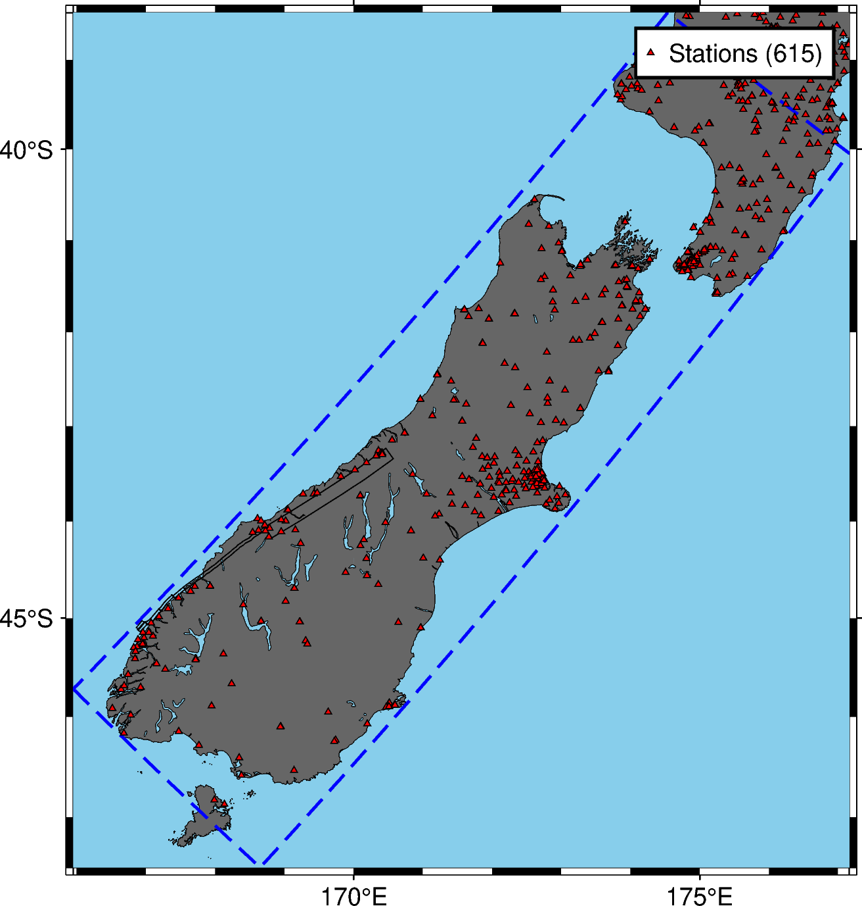

# Plotting Realisation Domains

A how-to guide on using the `plot-domain` tool (part of the
`visualisation` repository) to visualise the spatial domain and related
features defined in simulation realisation files.

This tool is designed to create map-based plots showing the calculated simulation domain, optionally overlaying source geometry, station locations, and peak ground velocity (PGV) target contours.
All of the tools below can be invoked via the command line.


The components of the `plot-domain` tool (plotting source geometry, stations, the domain, PGV target contours, and `plot-domain` itself) can be invoked in Python as an API for building your own custom scripts. See the [QuakeCoRE documentation](https://quakecoresoft.canterbury.ac.nz/docs/visualisation.realisation.html) for general API documentation.

## Installing the Plotting Tools

Before you can plot anything, you need to have the necessary environment
and the `visualisation` repository installed. If you followed the
installation steps for other plotting tools (like `plot-srf`), you
should already have this.

A typical installation might involve:

``` bash
# Example - adapt as needed for your environment setup
pip install git+https://github.com/ucgmsim/visualisation
# Or install via your specific environment management tools
```

Assuming you've done that correctly, you should be able to execute
`plot-domain --help` and get output similar to this (generated from the
script's options):

```
Usage: plot-domain [OPTIONS] REALISATION_FFP OUTPUT_FFP

 Plot the domain and sources of a realisation to a file.

╭─ Arguments ───────────────────────────────────────────────────────────────────────────────────────────────────────────────────────────────────────────────────────────────────────────────────────────────────────╮
│ *    realisation_ffp      FILE  Path to the realisation file to plot. [required]                                                                                                                                  │
│ *    output_ffp           FILE  [required]                                                                                                                                                                        │
╰───────────────────────────────────────────────────────────────────────────────────────────────────────────────────────────────────────────────────────────────────────────────────────────────────────────────────╯
╭─ Options ─────────────────────────────────────────────────────────────────────────────────────────────────────────────────────────────────────────────────────────────────────────────────────────────────────────╮
│ --latitude-pad                                         FLOAT RANGE [x>=0]  Latitude padding in degrees. [default: 0]                                                                                              │
│ --longitude-pad                                        FLOAT RANGE [x>=0]  Longitude padding in degrees. [default: 0]                                                                                             │
│ --title                                                TEXT                Title of the plot. [default: None]                                                                                                     │
│ --subtitle                                             TEXT                Subtitle of the plot. [default: None]                                                                                                  │
│ --width                                                FLOAT RANGE [x>=0]  Width of the plot in cm. [default: 10]                                                                                                 │
│ --dpi                                                  FLOAT RANGE [x>=0]  DPI of the plot (higher is better quality). [default: 300]                                                                             │
│ --show-geonet-stations    --no-show-geonet-stations                        Show GeoNet stations on the plot.                                                                                                      │
│ --show-geometry           --no-show-geometry                               Show source geometry on the plot. [default: show-geometry]                                                                             │
│ --show-pgv-targets        --no-show-pgv-targets                            Show PGV targets on the plot. [default: no-show-pgv-targets]                                                                           │
│ --pgv-target                                           FLOAT               PGV targets to plot. If None, use PGV targets from the realisation. A non-empty value implies `show_pgv_targets`. [default: None]      │
│ --stations                                             PATH                Path to list of stations to plot. [default: None]                                                                                      │
│ --install-completion                                                       Install completion for the current shell.                                                                                              │
│ --show-completion                                                          Show completion for the current shell, to copy it or customize the installation.                                                       │
│ --help                                                                     Show this message and exit.                                                                                                            │
╰───────────────────────────────────────────────────────────────────────────────────────────────────────────────────────────────────────────────────────────────────────────────────────────────────────────────────╯
```

Replace `REALISATION_FFP` with the path to your realisation file (e.g.,
`realisation.json`) and `OUTPUT_PLOT_FFP` with the desired name for your
output image (e.g., `domain_plot.png`).

This basic command will create a map plot showing:

1.  The simulation domain boundary (typically a blue dashed line).
2.  The earthquake source geometry (fault plane(s), typically a thin
    black line), as this is shown by default.


## Customising the Plot

Several options allow you to tailor the plot's appearance and content.

### Adjusting Map Bounds & Appearance

- **Padding:** Add space around the domain boundary using
  `--latitude-pad` and `--longitude-pad` (values are in degrees).
- **Titles:** Set a main title with `--title "My Plot Title"` and a
  subtitle with `--subtitle "Details..."`.
- **Size & Resolution:** Control the physical width of the plot with
  `--width` (in cm) and the image quality with `--dpi` (dots per inch,
  higher is better).

Example:

```bash
$ plot-domain alpine_base_1.json alpine_base_1_with_options.png --latitude-pad 0.5 --longitude-pad 0.5 --title "Padded Domain" --width 15
```

### Toggling Content

- **Source Geometry:** The source geometry is plotted by default. To
  hide it, use the `--no-show-geometry` flag.

  ```bash
  $ plot-domain alpine_base_1.json alpine_base_1_no_geometry.png --no-show-geometry
  ```
  

- **PGV Target Contours:** To visualise the areas estimated to reach
  certain peak ground velocity levels (used for simulation extent
  calculations), use `--show-pgv-targets`. By default, it reads the PGV target from the realisation used to calculate the size of the domain.

  ```bash
  $ plot-domain realisation.json domain_with_pgv.png --show-pgv-targets
  ```

  You can specify PGV levels (in cm/s) to plot contours for
  using `--pgv-target`. Use this option several times to plot several PGV levels. The `--pgv-target` option implies `--show-pgv-targets`, so you do not have to pass it separately if you do this.

  ```bash
  $ plot-domain realisation.json domain_custom_pgv.png --show-pgv-targets --pgv-target 5.0 --pgv-target 1.0
  ```

  

- **Custom Stations:** To plot specific locations (e.g., observation
  stations) on the map, provide a station file using the `--stations`
  option. The station file should be space-delimited with columns for
  longitude, latitude, and name (comments start with `#`).


  ```bash
  $ plot-domain realisation.json domain_with_stations.png --stations path/to/my_stations.ll
  ```

  Stations within the domain boundary will be plotted (typically as red
  triangles), and a legend indicating the number of stations in the domain will be added. See an example station file in [the QuakeCoRE dropbox](https://www.dropbox.com/scl/fi/bb852b1f0rly6cfvs9p9b/geoNet_stats-2023-06-28.ll?rlkey=3y8k5qviy52nbksfdkm1n92yh&st=92bvmzph&dl=0).

  
# Plotting Realisation Rupture Paths
The `plot-rupture-path` CLI tool plots a realisation rupture path *prior* to generating an SRF (See [the sources plotting tools](Sources.md) to work with SRFs instead). This can be useful for debugging the rupture propagation process.

You can find the help text for this tool with `plot-rupture-path --help`

```
 Usage: plot-rupture-path [OPTIONS] REALISATION_FFP OUTPUT_FFP

 Plot a rupture path from a realisation to a file.

╭─ Arguments ───────────────────────────────────────────────────────────────────────────────────────────────────────────────────────────────────────────────────────────────────────────────────────────────────────────────────────────────────────────────────────────────────────────────────────────────────────────────────────────────────────╮
│ *    realisation_ffp      FILE  The realisation to plot. [default: None] [required]                                                                                                                                                                                                                                                               │
│ *    output_ffp           FILE  The output image path. [default: None] [required]                                                                                                                                                                                                                                                                 │
╰───────────────────────────────────────────────────────────────────────────────────────────────────────────────────────────────────────────────────────────────────────────────────────────────────────────────────────────────────────────────────────────────────────────────────────────────────────────────────────────────────────────────────╯
╭─ Options ─────────────────────────────────────────────────────────────────────────────────────────────────────────────────────────────────────────────────────────────────────────────────────────────────────────────────────────────────────────────────────────────────────────────────────────────────────────────────────────────────────────╮
│ --title                     TEXT                The title of the plot. [default: None]                                                                                                                                                                                                                                                            │
│ --latitude-pad              FLOAT RANGE [x>=0]  The latitude padding too apply (in degrees). [default: 0]                                                                                                                                                                                                                                         │
│ --longitude-pad             FLOAT RANGE [x>=0]  The longitude padding to apply (in degrees). [default: 0]                                                                                                                                                                                                                                         │
│ --width                     FLOAT RANGE [x>=0]  The width of the plot (in cm). [default: 17]                                                                                                                                                                                                                                                      │
│ --subtitle                  TEXT                A plot subtitle. [default: None]                                                                                                                                                                                                                                                                  │
│ --install-completion                            Install completion for the current shell.                                                                                                                                                                                                                                                         │
│ --show-completion                               Show completion for the current shell, to copy it or customize the installation.                                                                                                                                                                                                                  │
│ --help                                          Show this message and exit.                                                                                                                                                                                                                                                                       │
╰───────────────────────────────────────────────────────────────────────────────────────────────────────────────────────────────────────────────────────────────────────────────────────────────────────────────────────────────────────────────────────────────────────────────────────────────────────────────────────────────────────────────────╯
```

Replace `REALISATION_FFP` with the path to your realisation file (e.g.,
`realisation.json`) and `OUTPUT_PLOT_FFP` with the desired name for your
output image (e.g., `rupture_path.png`).

This basic command will create a map plot showing:

1. The earthquake source geometry (fault plane(s), typically polygons with a thin black line and white fill).
2. The planned path the rupture will take through the faults, indicated by arrows.

> [!NOTE]
> The arrows do not indicate the precise location that the rupture will jump between faults. They only indicate the order the faults will rupture in.


The options `--title`, `--latitude-pad`, `--longitude-pad`, `--width` and `--subtitle` behave as they do for plotting realisation domains.
