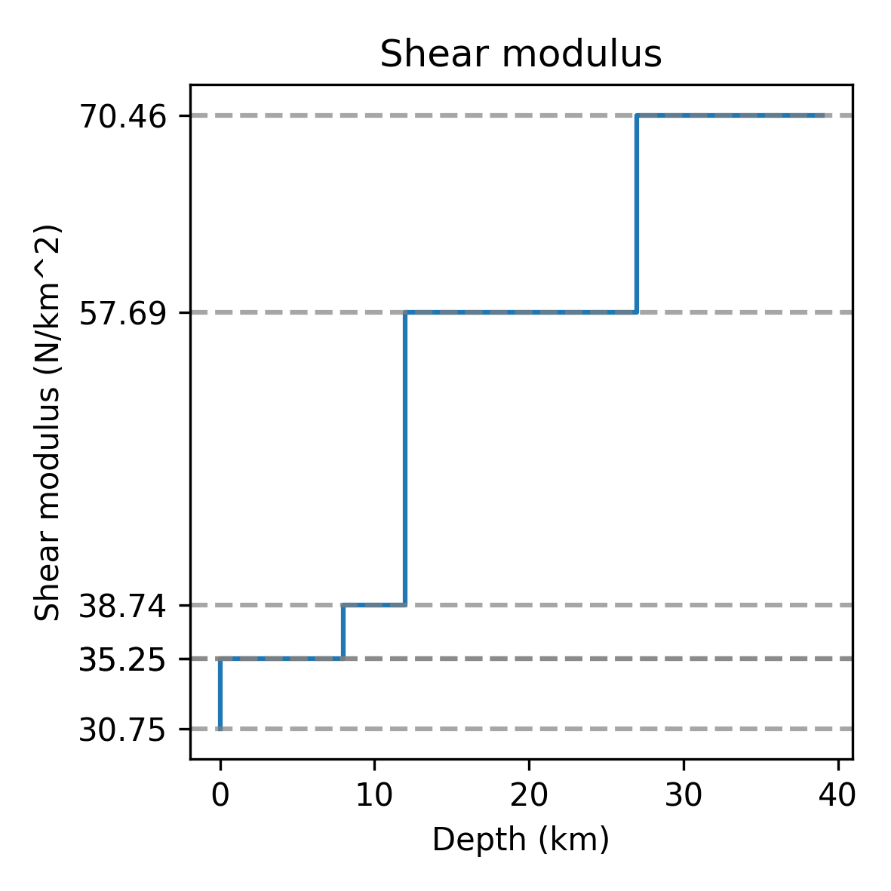
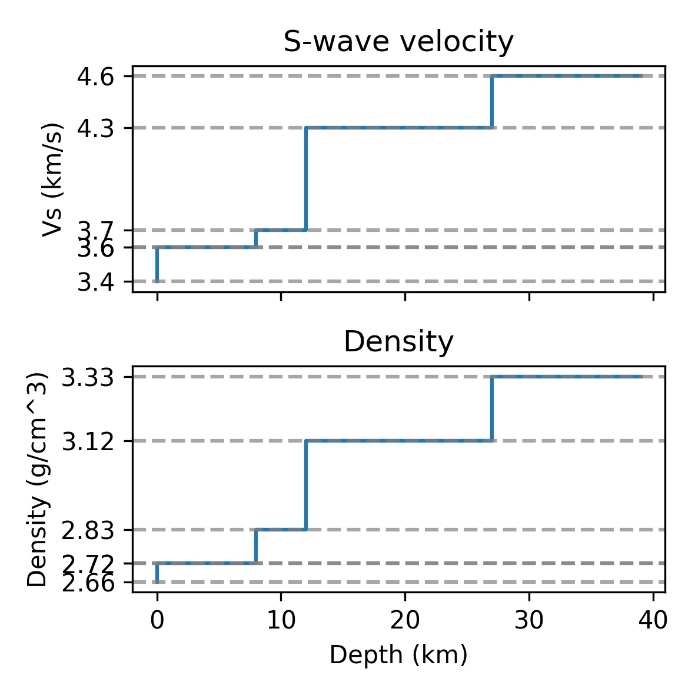
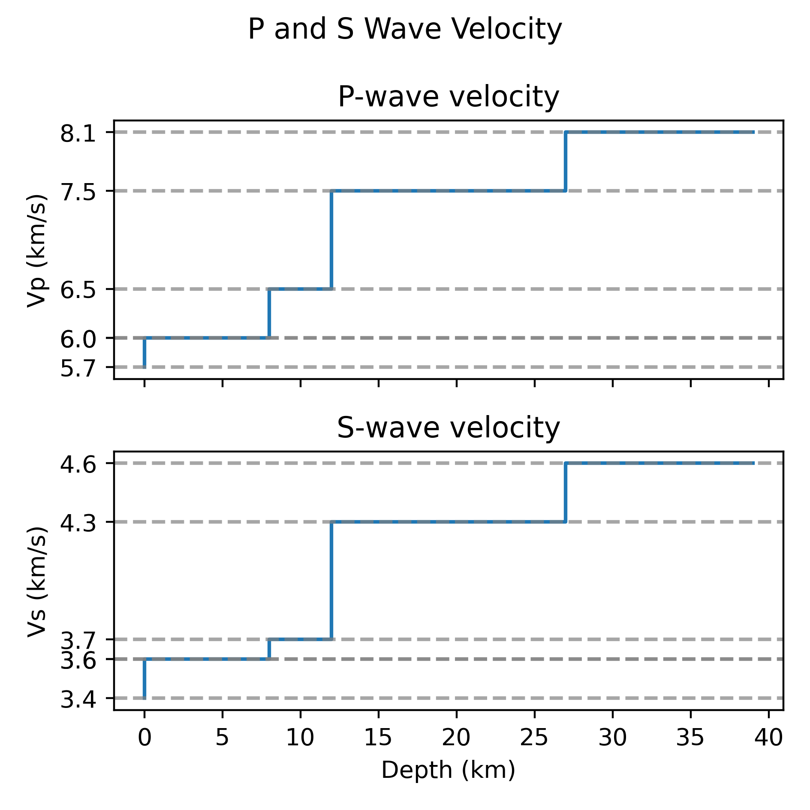

# Plotting 1D Velocity Models

This tool creates step plots showing selected physical properties (like P-wave velocity, S-wave velocity, density) against depth, based on the velocity model defined in a realisation.

This tool is invoked via the command line. It can also be invoked from Python. See the [QuakeCoRE docs](https://quakecoresoft.canterbury.ac.nz/docs/visualisation.plot_1d_velocity_model.html) for API documentation.

## Installing the Plotting Tools

Ensure you have the necessary environment and the `visualisation` repository installed. If you followed the installation steps for other plotting tools (like `plot-srf` or `plot-domain`), you should already have this.

A typical installation might involve:

``` bash
# Example - adapt as needed for your environment setup
pip install git+https://github.com/ucgmsim/visualisation
# Or install via your specific environment management tools
```

Assuming you've done that correctly, you should be able to execute `plot-1d-velocity-model --help` and get output similar to this (generated from the script's options):

```
 Usage: plot-1d-velocity-model [OPTIONS] VELOCITY_MODEL_FILE OUTPUT_FILE

 Plot the 1D velocity model from a realisation.

╭─ Arguments ───────────────────────────────────────────────────────────────────────────────────────────────────────────────────────────────────────────────────────────────────────────────────────────────────────────────────────────────────────────────────────────────────────────────────────────────────────────────────────────────────────╮
│ *    velocity_model_file      FILE  The path to the velocity model file. [default: None] [required]                                                                                                                                                                                                                                               │
│ *    output_file              FILE  The path to save the plot. [default: None] [required]                                                                                                                                                                                                                                                         │
╰───────────────────────────────────────────────────────────────────────────────────────────────────────────────────────────────────────────────────────────────────────────────────────────────────────────────────────────────────────────────────────────────────────────────────────────────────────────────────────────────────────────────────╯
╭─ Options ─────────────────────────────────────────────────────────────────────────────────────────────────────────────────────────────────────────────────────────────────────────────────────────────────────────────────────────────────────────────────────────────────────────────────────────────────────────────────────────────────────────╮
│ --panel                     [vp|vs|density|qp|qs|mu]  The panels to plot. [default: mu]                                                                                                                                                                                                                                                           │
│ --subplot-width             FLOAT RANGE [x>=0]        The width of the individual subplots. [default: 10]                                                                                                                                                                                                                                         │
│ --subplot-height            FLOAT RANGE [x>=0]        The height of the individual subplots. [default: 10]                                                                                                                                                                                                                                        │
│ --dpi                       INTEGER RANGE [x>=0]      The resolution of the plot (higher is better). [default: 300]                                                                                                                                                                                                                               │
│ --title                     TEXT                      The title of the plot. [default: None]                                                                                                                                                                                                                                                      │
│ --install-completion                                  Install completion for the current shell.                                                                                                                                                                                                                                                   │
│ --show-completion                                     Show completion for the current shell, to copy it or customize the installation.                                                                                                                                                                                                            │
│ --help                                                Show this message and exit.                                                                                                                                                                                                                                                                 │
╰───────────────────────────────────────────────────────────────────────────────────────────────────────────────────────────────────────────────────────────────────────────────────────────────────────────────────────────────────────────────────────────────────────────────────────────────────────────────────────────────────────────────────╯

```

> [!NOTE]
> You can get help text for this tool by passing the `--help` flag.


## How Do I Plot a 1D Velocity Model?

You need the `plot-1d-velocity-model` command. With the prerequisites installed, execute:

``` bash
$ plot-1d-velocity-model REALISATION_FFP OUTPUT_PLOT_FFP
```

Replace `REALISATION_FFP` with the path to your realisation file. The `OUTPUT_PLOT_FFP` should be replaced with the path to the output plot.

By default, this command will create a plot showing only the **Shear Modulus (Mu)** against depth.



## Customising the Plot

Several options allow you to select which properties are plotted and adjust the appearance.

### Selecting Properties to Plot (`--panel`)

The `--panel` option determines which physical properties are plotted, each in its own subplot stacked vertically. You can use this option multiple times to include several properties. If omitted, only `MU` is plotted.

Available panels are (case-insensitive):
* `Vp`: P-wave velocity
* `Vs`: S-wave velocity
* `Density`: Density
* `Qp`: P-wave quality factor
* `Qs`: S-wave quality factor
* `Mu`: Shear Modulus (calculated from Vs and density)

Examples:

* To plot just Vp and Vs:
``` bash
$ plot-1d-velocity-model velocity_model.txt vp_vs_plot.png --panel VP --panel VS
```

* To plot Density, Vs, and Qs:

``` bash
$ plot-1d-velocity-model velocity_model.txt dens_vs_qs.png --panel DENSITY --panel VS --panel QS
```

* To plot all available panels:

``` bash
$ plot-1d-velocity-model velocity_model.txt all_panels.png --panel VP --panel VS --panel DENSITY --panel QP --panel QS --panel MU
```



### Adjusting Plot Appearance

* **Title:** Add an overall title to the figure using `--title "My Velocity Model Plot"`.
* **Subplot Size:** Control the dimensions of *each individual subplot* using `--subplot-width` and `--subplot-height` (values in cm). The total figure height will depend on the number of panels selected.
* **Resolution:** Set the output image quality using `--dpi` (dots per inch). Higher values produce larger files with better resolution.

Example combining options:

``` bash
$ plot-1d-velocity-model realisation.json custom_plot.png --panel vp --panel vs --title "P and S Wave Velocity" --subplot-width 12 --subplot-height 12 --dpi 400
```


